## Toy Shop

The aim of this site was to help my son improve his understanding of mathematics in a fun and engaging way. I wanted to create a simple yet interactive game that he could enjoy while practicing essential math skills. The Toy Shop game allows users to search for toys, select their favorites, and simulate buying them using virtual coins. This not only makes learning arithmetic enjoyable but also helps users understand the value of money through playful interaction.

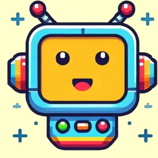

## Table of contents 
- [Wire Frame](#wire-frame)
- [Learning Outcomes](#learning-outcomes)
  - [Learning Outcome 1](#lo1-design-an-interactive-front-end-web-application-using-html-and-css-and-javascript-based-on-the-principles-of-user-experience-design-accessibility-and-responsivity)
  - [Learning Outcome 2](#lo2-test-a-front-end-web-application-through-the-development-implementation-and-deployment-stages)
  - [Learning Outcome 3](#lo3-deploy-a-front-end-web-application-to-a-cloud-platform)
  - [Learning Outcome 4](#lo4-maximize-future-maintainability-through-documentation-code-structure-and-organization)
  - [Learning Outcome 5](#lo5-demonstrate-and-document-the-development-process-through-a-version-control-system-such-as-github)
  - [Learning Outcome 6](#lo6-implement-front-end-interactivity-using-core-javascript-javascript-libraries-or-frameworks)
- [Features](#features)
- [Favicon](#favicon)
- [Header](#header)
- [Footer](#footer)
- [Main Page](#main-page)
- [Search Gallery Page](#search-gallery-page)
- [Game Page](#game-page)
- [Success Page](#success-page)
- [Well Done - New Game Page](#well-done---new-game-page)
- [404 Page](#404-page)
- [API Whitelisting](#api-whitelisting)
- [Process of creating a custom search and API Restriction](#process-of-creating-a-custom-search-and-api-restriction)
- [Testing](#testing)
  - [Device Compatibility](#device-compatibility)
  - [Browser Coverage](#browser-coverage)
  - [Accessibility Testing](#accessibility-testing)
  - [Validation Testing](#validation-testing)
- [Deployment](#deployment)
- [Development and source control](#development-and-source-control)
- [Deployment Process](#deployment-process)
- [Cloning](#cloning)
- [References](#references)
- [Technologies Used](#technologies-used)
- [Credit](#credit)


## Wire Frame
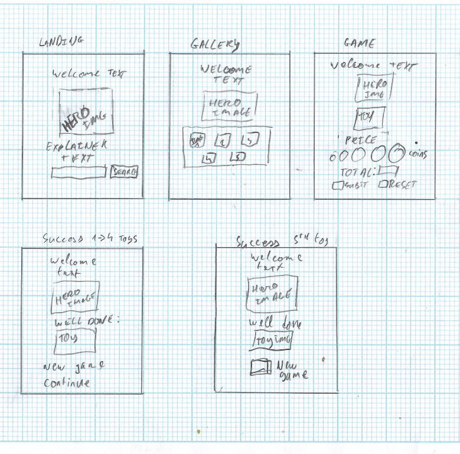


## Learning Outcomes

**LO1: Design an interactive Front-End web application using HTML and CSS and JavaScript based on the principles of user experience design, accessibility, and responsivity.**

I created a website using HTML, styled with CSS, and added functionality to it by using JavaScript. The website has a clean UX that is responsive and well adapted to all screen sizes, from small-screened mobile devices to ultrawide PC monitors. Accessibility is achieved by the use of `aria-label` for both user inputs as well as sounds.

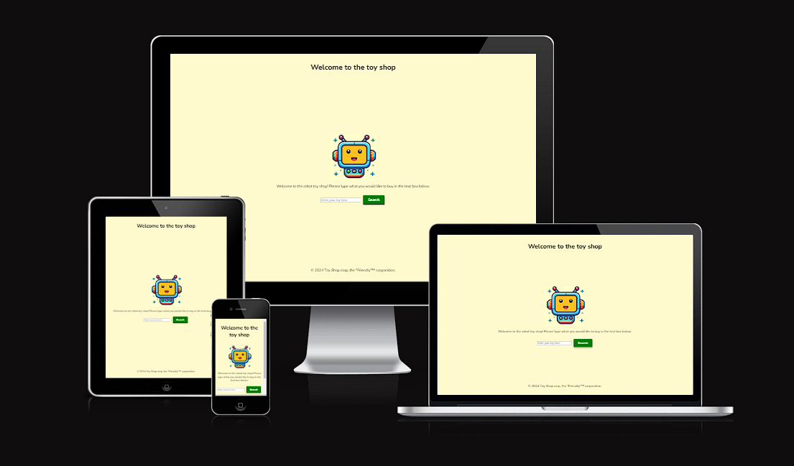

**LO2: Test a front-end web application through the development, implementation, and deployment stages.**

My site's JavaScript uses `DOMContentLoaded` to initialize the application once the `index.html` is loaded. I have form validation to ensure there is viable data entered into the search box, and errors are handled gracefully with failover scenarios and fetch errors for the image searches. The final submitted site design was the product of a strict design-build-test-iterate cycle, ensuring steady incremental improvements in the product for the deliverable to the user.

**LO3: Deploy a Front-End web application to a Cloud platform.**

The Toy Shop site has successfully been deployed to the web via GitHub Pages. The deployment not only assures the site is reachable on the general web but also was key to testing the design and eliminating bugs. The deployed site was continuously updated from the commits on the main project's GitHub repository.

**LO4: Maximize future maintainability through documentation, code structure, and organization.**

Maintainability was built in from the very first steps of the project. Clear naming conventions, modularized and clearly commented code all attest to well-structured and organized code. The README provides a clear guide on the project.

**LO5: Demonstrate and document the development process through a version control system such as GitHub.**

The entire development of the project has been managed using GitHub as its version control and development environment. Changes have been committed regularly with clear commit messaging, allowing a full overview of the progress and milestones of the project's process from concept to submission.

**LO6: Implement Front-End interactivity, using core JavaScript, JavaScript libraries, or frameworks.**

The site uses JavaScript to implement interactive features such as updating the DOM based on user input and interactions. The content of the site is also dynamically updated based on the user's input and a call to a custom Google Image search.

## Features 

The overall goal for this website is to take a user input search query, pass it off to a Google Custom Image search API. Before the query is passed along, I append 'toy' to the search query to ensure the user is given toy versions of what they look for; the search query passed to the custom Google Image search is limited to five results. Those five results are presented to the user. The user selects one of the toys to 'buy' and they are presented with virtual coins and a price to make up by clicking on the coins. The objective of the site is to grant the user a better understanding of the basic arithmetic involved in money.

## Favicon 

- Toy Shop robot favicon has been implemented on all pages.
- Bookmarks and mobile home screen pins also use the favicon. 

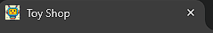

## Header

- The toy shop header holds the simple message to the user "Welcome to the toy shop"


## Footer

- The footer contains a trademark message of the Toy Shop corp. the "Friendly"™ corporation. 

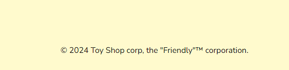

## Main Page 

- The main page of the site forms the stepping stone for the user to the rest of the site's features. 
- There is a hero image of a happy, cheerful, innocent robot who is here to help.
- The search bar is validated for correct input.
- The search bar changes the cursor to a pointer and is reactive on mouse over and click.
- The search bar has an 'aria-label' to aid with accessibility.

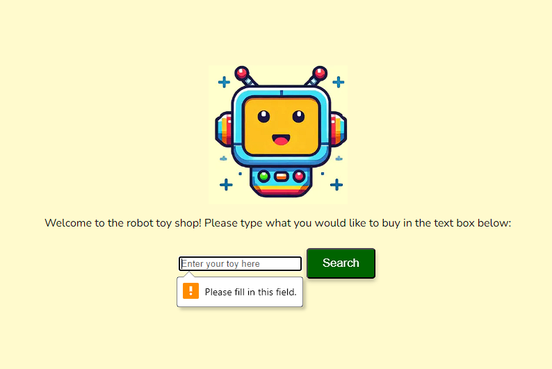

## Search Gallery Page

- The gallery page is where a gallery of five images of the user's search query are displayed. 
- The user is instructed to select one of the images to advance to the next stage. 
- The images are responsive to mouse over and the cursor changes to a pointer to reinforce the interactivity of the images. 
- The gallery is fully responsive to screen sizes from 250px to 3440px wide.

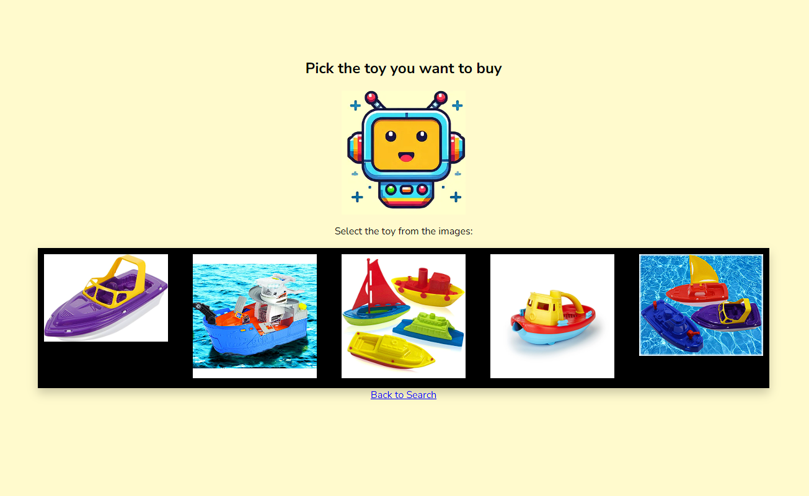

## Game Page

- The main game page has instructions to the user on how to 'pay' for the item.
- The page has the same toy displayed as chosen by the user in the previous step.
- The coins are reactive to hover over, expanding and changing the cursor to a grabber to indicate interactivity. 
- The give money to the shop keeper button submits the user's total to be checked against the price total. If the user is under or over the price, they are given text feedback as to which it is. 
- Both buttons are responsive to mouse over and click.

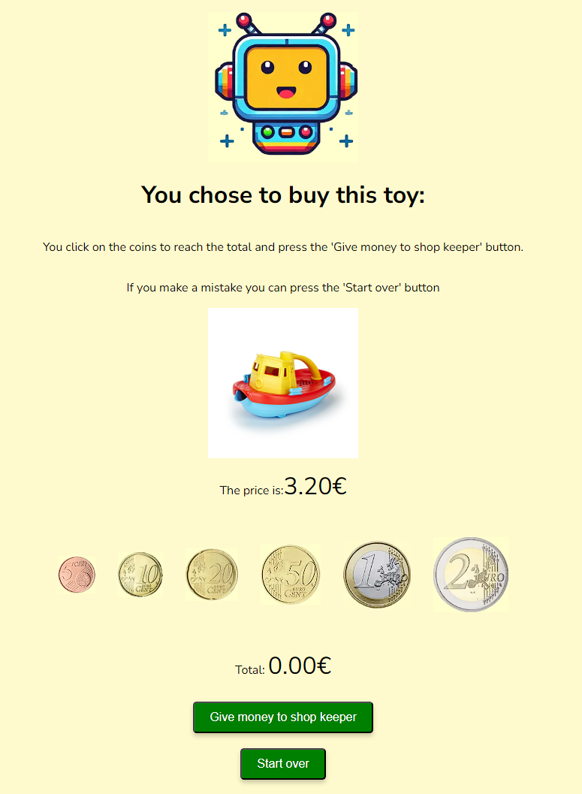

## Success Page

- The success page is displayed when the user submits a total that matches the price. 
- When the page is loaded, a success fanfare audio file is played. The file clip has an 'aria-label' associated with it for accessibility. 
- The continue button returns the user back to the gallery of toys they have just chosen from.
- The new game button returns the user to the main page, allowing them to select a new toy to play the game with. 
- Both buttons are responsive to mouse over and click. The cursor changes to a pointer on mouse over.

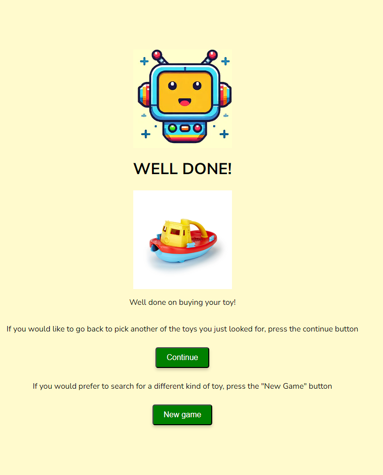

## Well Done - New Game Page

- After the user has bought one of the five toys from a gallery, they are shown this page.
- The user is given a message that they have bought all the toys they searched for.
- The user only has a new game option from here. 

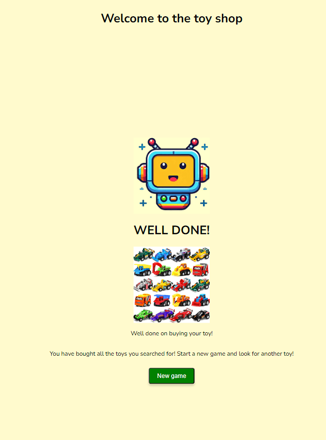

## 404 Page

- There is a 404 page should the user somehow find themselves where they shouldn't.

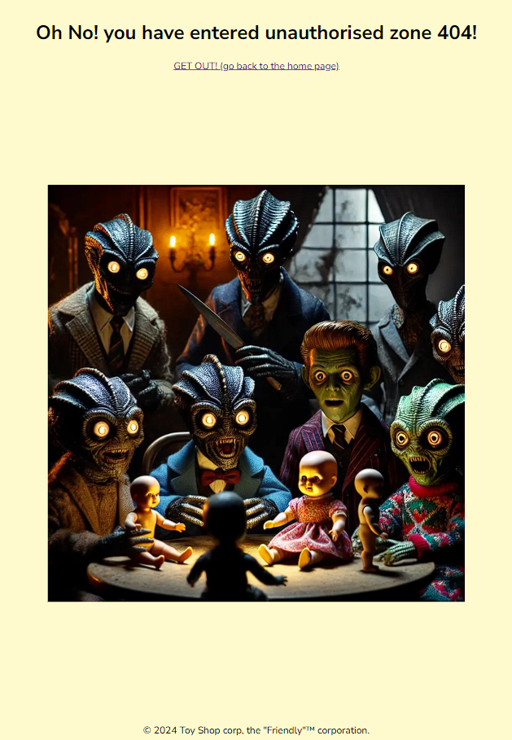

## API Whitelisting

- During the prototyping phase of the project, I became concerned with how to protect my Google Custom Image search API key. I quickly determined that since this was an entirely front-end hosted web app, there was no easy way to obfuscate the key. Instead, after reading through the Google Custom Image search documentation, I learned that I was able to lock down calls to the API from certain whitelisted sites of my choosing. The API is whitelisted for the deployment URL and the code space I used to develop the project.

# Process of creating a custom search and API Restriction
- Go to Google cloud console.
- Create a new project.
- Give it a name, click create.
- Open the APIs and Services tab.
- Search for 'custom image search API', click 'Enable'.
- Open credentials section, click create credentials followed by 'API Key'
- Copy the API key generated.
- Open a new tab and go to 'Google custom search engine'
- Choose to create a new search engine.
- Customise the new engine to be an image only serach also enable safe search.
- Open the 'Search Engine ID' link, note the search engine ID for using in API calls.
- Return to the API and Services section, click on credentials.
- Click to edit your API.
- Click to add restrictions on HTTP traffic 
- Enter the sites you wish to whitelist. 
- Click on Save and your API key has been restricted to the sites you specified. 

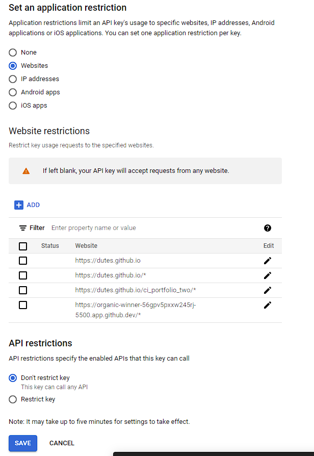


### Testing

Testing of the project was at first conducted on an ongoing ad-hoc basis following the rapid prototyping methodology. 
Below is an extract of the test script used to test and validate the project:

| Test Title                   | Test Steps                                                                              | Validation                                               | Results |
| ---------------------------- | --------------------------------------------------------------------------------------- | -------------------------------------------------------- | ------- |
| Search bar - entry           | 1\. Attempt to enter a leading and tailing space on a query  in the search bar          |                                                          |         |
|                              | 2\. click search                                                                        |                                                          |         |
|                              | 3\. verify A)                                                                           | A) The white spaces are removed                          |         |
| Search bar - empty           | 1\. Attempt to click search without entering anything in the search bar                 |                                                          |         |
|                              | 2.Verify A)                                                                             | A) The search is blocked, some input is required         |         |
|                              |                                                                                         |                                                          |         |
| Gallery page - screen resize | 1\. On the gallery page, resize the screen                                              |                                                          |         |
|                              | 2\. Verify A)                                                                           | A) the gallery is not adversely affected by the resizing |         |
|                              |                                                                                         |                                                          |         |
| Game page - coins on resize  | 1\. on the game page resize the screen to 250px wide                                    |                                                          |         |
|                              | 2\. verify A)                                                                           | A) the coins are still functional                        |         |
|                              |                                                                                         |                                                          |         |
|                              | 1\. on the game page resize the screen to 3440px wide                                   |                                                          |         |
|                              | 2\. verify A)                                                                           | A) the coins are still functional                        |         |
|                              |                                                                                         |                                                          |         |
| Spam the buttons             | 1\. Attempt to break the search button by rapidly clicking on it                        |                                                          |         |
|                              | 2\. Verify A)                                                                           | A) the search button should suffer no ill effects        |         |
|                              |                                                                                         |                                                          |         |
|                              | 1\. Attempt to break the give money to the shop keeper button by rapidly clicking on it |                                                          |
|                              | 2\. Verify A)                                                                           | A) the search button should suffer no ill effects        |         |
|                              |                                                                                         |                                                          |         |
|                              | 1\. Attempt to break the start over button by rapidly clicking on it                    |                                                          |         |
|                              | 2\. Verify A)                                                                           | A) the search button should suffer no ill effects        |         |
|                              |                                                                                         |                                                          |         |
|                              | 1\. Attempt to break the new game button by rapidly clicking on it                      |                                                          |         |
|                              | 2\. Verify A)                                                                           | A) the search button should suffer no ill effects        |         |
|                              |                                                                                         |                                                          |         |
| buying all 5 toys            | 1\. Play the game                                                                       |                                                          |         |
|                              | 2\. buy each of the five toys in a collection                                           |                                                          |         |
|                              | 3\. Verify A)                                                                           | A) the user is only given the new game option            |         |


Here is a breakdown of the devices the projected was tested across:

| Device      | Main Page | Gallery | Well done | Success | 404  |
|-------------|-----------|---------|-----------|---------|------|
| Pixel 8     | Pass      | Pass    | Pass      | Pass    | Pass |
| Pixel 4     | Pass      | Pass    | Pass      | Pass    | Pass |
| Nokia t20   | Pass      | Pass    | Pass      | Pass    | Pass |
| Iphone 8+   | Pass      | Pass    | Pass      | Pass    | Pass |
| Ipad Pro 13 | Pass      | Pass    | Pass      | Pass    | Pass |


And here is the browser coverage for testing:

|            | Chrome | Safari | Firefox | Edge | Opera | Arc  | Resolution range |
| ---------- | ------ | ------ | ------- | ---- | ----- | ---- | ---------------- |
| Windows 11 | Pass   | Pass   | Pass    | Pass | Pass  | Pass | 250px - 3440px   |
| Mac OS     | Pass   | Pass   | Pass    | Pass | Pass  | Pass | 250px - 2560px   |


### Accessibility Testing:
Accessibility was considered from the very beginning of the project. To that end, best practices were followed and the LightHouse and Wave test results represent that consideration. 
In addition to the search box aria tag, a second aria tag was added to the sound file triggered once the user is successful in buying a toy.

# Desktop LightHouse Result:
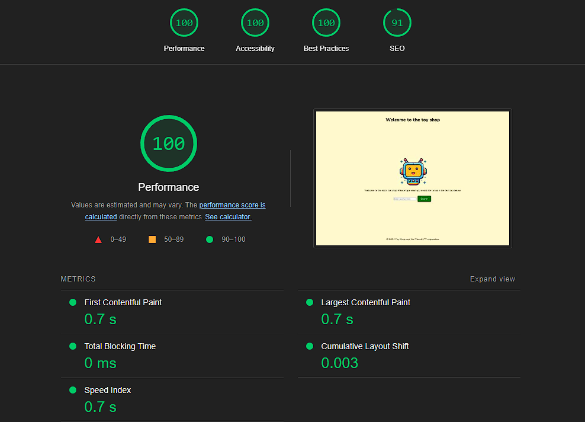


# Mobile LightHouse Result:
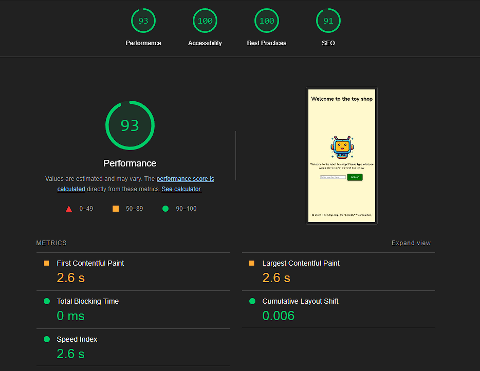


# Wave Result:
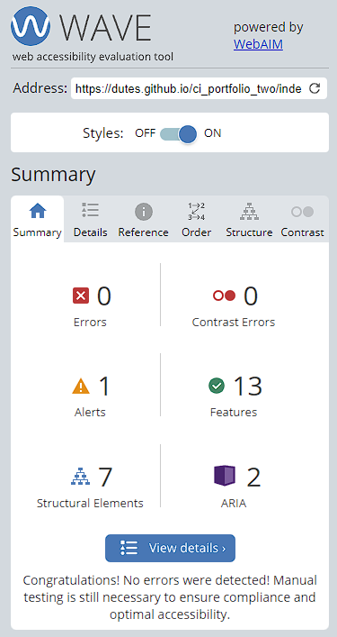


### Validation Testing
The web site was ran through the W3C HTML and CSS validators and passed without any errors.

### Deployment

## Development and source control

The site was created using Visual Studio and source code controlled in a GitHub repository.
When I wanted to commit new code to the project I used the following commands:

```git add <filename>``` 
-this added the chosen file to the staging area.

```git commit -m "commit message"``` -this command committed the files in staging to the local repository with a short piece on what changes I had made that I wanted to add to the project.

```git push``` -this command pushed (or synced) the committed changes to the remote repository on my GitHub account.

## Deployment Process

The site is deployed to GitHub Pages.
The process is as follows:
 - Open the github repository, navigate to settings tab.
 - From the left hand side menu, open the 'Pages' link.
 - Select Main from the source drop-down.
 - The deployment process will begin and progress can be observed with the ribbon display on the right hand side of the Github page. Once the displays green the site should be deployed.

 The live link to the site is: [Toy Shop](https://dutes.github.io/ci_portfolio_two/index.html)

 ## Cloning

 To work on the project locally you follow these steps:
 - Click on the code dropdown menu button
 - Click on HTTPS
 - Copy the link to the repository
 - Ensure your local IDE has github installed (for example as an extension in VStudio)
 - Open the IDE's terminal and type:

```git clone <paste link copied from repo>```

 - hit enter and the project will be cloned locally for you to work on.


### References
***JavaSriptInfo***

[JavaScriptInfo](https://javascript.info/)  - Used for extensive referencing and learning.

***Google Dev Help***

[Google](https://developers.google.com/custom-search/v1/introduction) - Used for setting up custom search API functionality.

***W3Schools Javascript***

[W3cJavaScript](https://www.w3schools.com/js/) - Used during module for greater understanding of concepts of JavaScript.

***MDN JavaScript***

[MDN](https://developer.mozilla.org/en-US/docs/Learn/JavaScript/First_steps/What_is_JavaScript) - Useful for more technically detailed aspects of JavaScript


### Technologies Used
- HTML
    - Used for main page.
- CSS
    - Used to style site.
- JavaScript
    - Used to code the functionality of the site.
- GitHub 
  - Source control and storage.
- GitHub Pages
  - Deployment of site.
- Git 
  - Used to commit code to source control.
- Tinyjpg
  - [Tinyjpg](https://tinyjpg.com/) used to compress image assets of the web site.
- Favicon
  - [Favicon](https://favicon.io/favicon-converter/) used to generate the favicons for the site.
- Google Fonts
  - [Google Fonts](https://fonts.google.com/) Used for the fonts on the site.
- Excel to Markdown
  - [Excel to Markdown](https://tabletomarkdown.com/convert-spreadsheet-to-markdown/) Used for tables in testing section
- Remove Background
   - [Remove background](https://www.remove.bg/upload) Used to remove the background from the site images.

### Credit
- Audio file taken from [Pixelbay](https://pixabay.com/).

